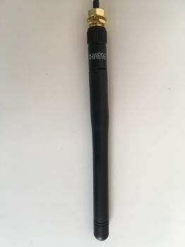
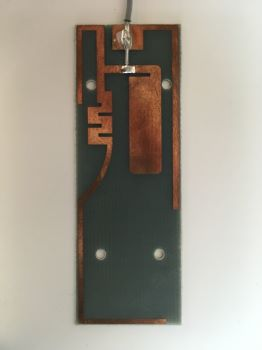
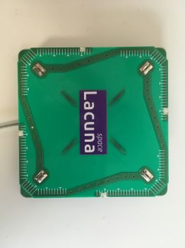
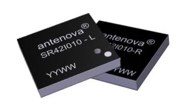
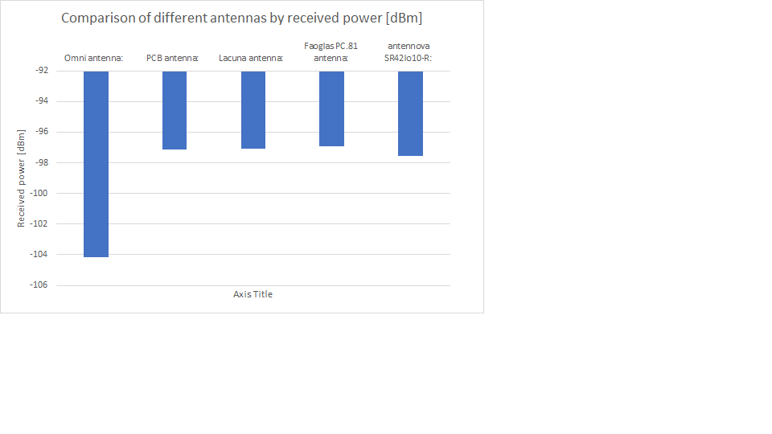

# Measurements of several antennas by Irnas 
### Selection of antennas:
Omni antenna:  

  

PCB antenna:  

  

Lacuna antenna:  

  

Faoglas PC.81 antenna:  

  

antennova SR42Io10-R:  

Type of antenna | Received power [dBm]
:---|---
Omni antenna:|  	-104,16
PCB antenna:  |	-97,12
Lacuna antenna:|  	-97,09
Faoglas PC.81 antenna:|  	-96,91
antennova SR42Io10-R:|  	-97,56  

## Comparisons between antenna types:  

